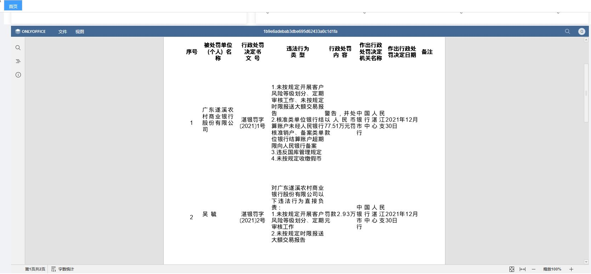

# vue-office-preview

# 介绍
  Office在线预览组件。

# 样例




# 开始

```javascript
npm install vue-office-preview --save
```

# 使用
```javascript
import VueOfficePreview from 'vue-office-preview ';
Vue.use(VueOfficePreview)
```
# 支持文件格式
|         |  
|  ----   | 
|'doc', 'docm', 'docx', 'dot', 'dotm', 'dotx', 'epub', 'fodt', 'htm', 'html','mht', 'odt', 'ott', 'pdf', 'rtf', 'txt', 'djvu', 'xps'|
|'csv', 'fods', 'ods', 'ots', 'xls', 'xlsm', 'xlsx', 'xlt', 'xltm', 'xltx'| 
|'fodp', 'odp', 'otp', 'pot', 'potm', 'potx', 'pps', 'ppsm', 'ppsx', 'ppt', 'pptm', 'pptx'| 
 


# option参数说明
  |  名称   | 是否必填  | 类型  |默认值| 说明        |
  |  ----   |  ----   | ----  | ----  | ----      |
  | fileType|    是   |  string | '' |  文件类型（扩展名）   |
  | title|    否   |  String | '' |  文件标题  |
  | key|    否   |  String |  '''   |文件索引 |
  | url|    是   |  String | 100 |  文件地址 |
  | width|    否   |  string | 100%|  视口宽度   |
  | height|    否   |  string | 300px | 视口高度   |
  | lang|    否   |  string | 'zh-CN' |  语言   |
 


# 样例

```
    const option = {
        'lang' : 'zh-CN',
        'url' : 'https://qccdata.qichacha.com/CaseSupervisePunish/1b9e6adebab3dbe695d62433a0c1d1fa.DOC',
        'title' : '1b9e6adebab3dbe695d62433a0c1d1fa',
        'fileType' : 'DOC'
    }
   <VueOfficePreview  :option='option' />
  ```